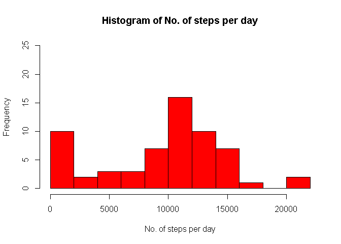
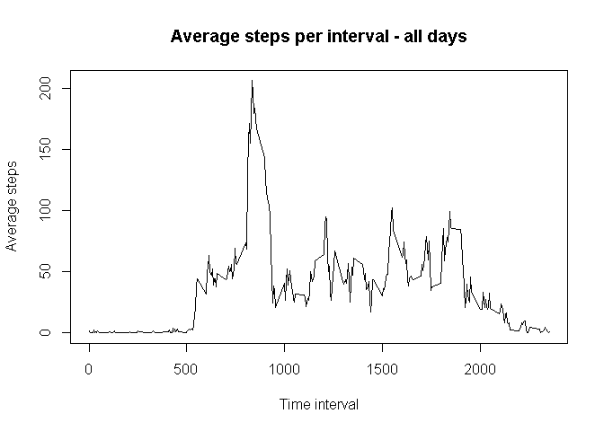
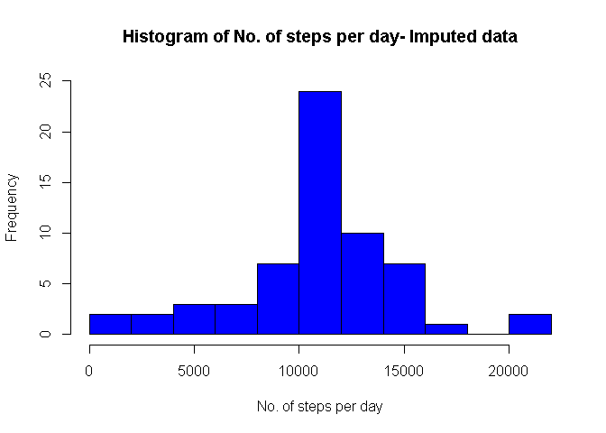
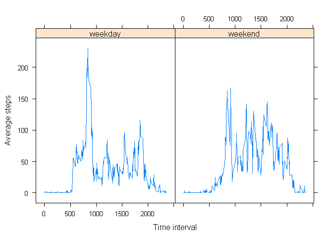

 
## Loading and preprocessing the data


```r
        act_org <- read.csv(unzip("activity.zip")) #original data
          str(act_org)
```

```
## 'data.frame':	17568 obs. of  3 variables:
##  $ steps   : int  NA NA NA NA NA NA NA NA NA NA ...
##  $ date    : Factor w/ 61 levels "2012-10-01","2012-10-02",..: 1 1 1 1 1 1 1 1 1 1 ...
##  $ interval: int  0 5 10 15 20 25 30 35 40 45 ...
```

```r
          head(act_org)
```

```
##   steps       date interval
## 1    NA 2012-10-01        0
## 2    NA 2012-10-01        5
## 3    NA 2012-10-01       10
## 4    NA 2012-10-01       15
## 5    NA 2012-10-01       20
## 6    NA 2012-10-01       25
```

```r
        act_copy <- act_org # creates copy to work on
        act_copy$date <- as.character(act_copy$date) #converts to 
        #character in order to convert to date
        act_copy$date <- as.Date(act_copy$date,format = "%Y-%m-%d") #convert to date format
```


## What is mean total number of steps taken per day?

```r
        subdata <- aggregate(act_copy$steps,by = list(c(act_copy$date)),sum,na.rm= TRUE)
        names(subdata) <- c("date","steps_count")
        head(subdata)   # steps per day
```

```
##         date steps_count
## 1 2012-10-01           0
## 2 2012-10-02         126
## 3 2012-10-03       11352
## 4 2012-10-04       12116
## 5 2012-10-05       13294
## 6 2012-10-06       15420
```

```r
        hist(subdata$steps_count,breaks = 10,ylim = c(0,25),col= "red",main = "Histogram of No. of steps per day", xlab = "No. of steps per day")
```

<!-- -->

```r
        mean(subdata$steps_count)
```

```
## [1] 9354.23
```

```r
        median(subdata$steps_count)
```

```
## [1] 10395
```


## What is the average daily activity pattern?


```r
        act_pat <- aggregate(act_copy$steps,by = list(c(act_copy$interval)),mean,na.rm = TRUE)
        names(act_pat) <- c("interval","mean_steps")
        
        plot(act_pat$interval,act_pat$mean_steps,type = "l",main = "Average steps per interval - all days",xlab = "Time interval",ylab = "Average steps")
```

<!-- -->

```r
        #Which 5-minute interval, on average across all the days in the dataset, contains the maximum number of steps?
        act_pat[which.max(act_pat$mean_steps),1]
```

```
## [1] 835
```
       
       
       
       The interval begining at time
        835 hrs contains the maximum average number of steps across all days.
        

## Imputing missing values

```r
        sum(is.na(act_org$steps)) #rows with NA
```

```
## [1] 2304
```
**I have used the five minute average to impute the missing values. The imputed numbers are rounded to the nearest integer**
        

```r
        act_pat$rnd <- round(act_pat$mean_steps,0) # mean steps to replace NA rounded.
        act_pat_new <- act_pat[,c(1,3)]
        act_imp <- merge(act_copy,act_pat_new)
        for (i in 1: nrow(act_copy) ){if(is.na(act_imp$steps[i])) {act_imp$steps[i] <- act_imp$rnd[i]} } #Replace NAs by mean
        act_imp <- act_imp[,-4] #act_imp is the imputed R file
        str(act_imp)
```

```
## 'data.frame':	17568 obs. of  3 variables:
##  $ interval: int  0 0 0 0 0 0 0 0 0 0 ...
##  $ steps   : num  2 0 0 0 0 0 0 0 0 0 ...
##  $ date    : Date, format: "2012-10-01" "2012-11-23" ...
```
## Histogram, mean and median of imputed data        


```r
        newdata <- aggregate(act_imp$steps,by = list(c(act_imp$date)),sum) #prepare imputed data for plot
        names(newdata) <- c("date","steps_count") 
        head(newdata)   # steps per day - imputed data
```

```
##         date steps_count
## 1 2012-10-01       10762
## 2 2012-10-02         126
## 3 2012-10-03       11352
## 4 2012-10-04       12116
## 5 2012-10-05       13294
## 6 2012-10-06       15420
```

```r
        hist(newdata$steps_count,breaks = 10,ylim = c(0,25),col= "blue",main = "Histogram of No. of steps per day- Imputed data", xlab = "No. of steps per day")
```

<!-- -->

```r
        mean(newdata$steps_count)
```

```
## [1] 10765.64
```

```r
        median(newdata$steps_count)
```

```
## [1] 10762
```
        
**Do these values differ from the estimates from the first part of the assignment? **
        
*Yes. As more values are included in the calculation mean and median  changes.*
       
**What is the impact of imputing missing data on the estimates of the total daily number of steps? **
        
*Total daily number of steps have increased as imputing has included numbers in the place of missing values *
       
       
        


## Are there differences in activity patterns between weekdays and weekends?


```r
        act_imp$day <- weekdays(act_imp$date) #adding new column and populating with days of the week
        
        act_imp$day <- gsub("^[Ss].*([Dd]ay)$","weekend",act_imp$day) #Replacing "Saturday" and "Sunday" with "weekend"
        act_imp$day <- gsub(".*(day)$","weekday",act_imp$day) #Replace others ending with "day" with "weekday"
        
        act_imp$day <- as.factor(act_imp$day) #converts into factor
        
        #Splits the file for calculating mean 
        
        wday <- subset(act_imp,act_imp$day == "weekday",c(1:4)) 
        wend <- subset(act_imp,act_imp$day == "weekend",c(1:4))
        
        
        act_imp_wday <- aggregate(wday$steps,by = list(c(wday$interval)),mean) #mean for weekday
        names(act_imp_wday) <- c("interval","mean_steps")
        
        act_wday <- merge(wday,act_imp_wday) # weekday file with mean
        
        act_imp_wend <- aggregate(wend$steps,by = list(c(wend$interval)),mean) # mean for weekend
        names(act_imp_wend) <- c("interval","mean_steps")
        
        act_wend <- merge(wend,act_imp_wend) #weekend file with mean
        
library(dplyr)
```

```
## Warning: package 'dplyr' was built under R version 3.6.3
```

```
## 
## Attaching package: 'dplyr'
```

```
## The following objects are masked from 'package:stats':
## 
##     filter, lag
```

```
## The following objects are masked from 'package:base':
## 
##     intersect, setdiff, setequal, union
```

```r
        act_imp_merge <- full_join(act_wday,act_wend) #merges to get a full file
```

```
## Joining, by = c("interval", "steps", "date", "day", "mean_steps")
```

```r
library(datasets)
library(lattice)
        
        
        
        xyplot(mean_steps ~ interval | day, data = act_imp_merge,type="l", xlab = "Time interval",ylab ="Average steps")
```

<!-- -->

